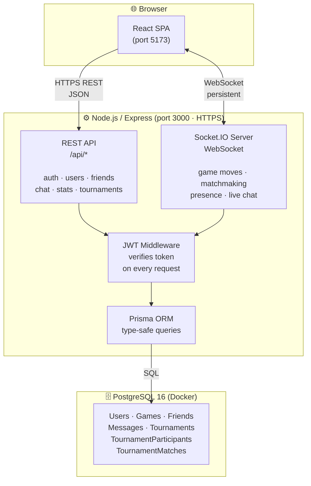
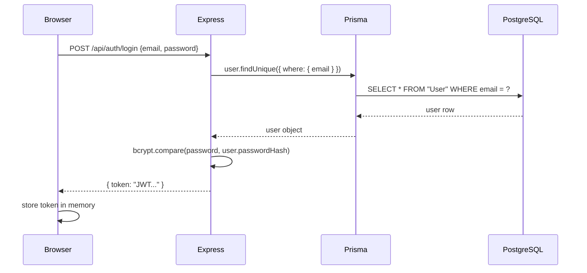
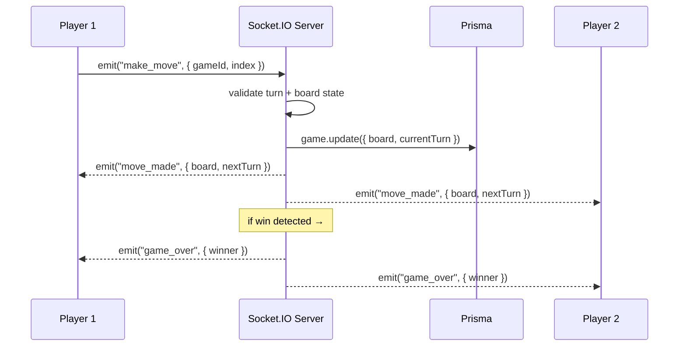

# Project Architecture — ft_transcendence

## System Overview



---

## Two Communication Channels

| | REST API | WebSocket |
|---|---|---|
| **Protocol** | HTTPS request/response | Persistent Socket.IO connection |
| **Used for** | Login, signup, profile, friends, stats, history | Live game moves, matchmaking queue, online presence, real-time chat |
| **Auth** | JWT in `Authorization` header | JWT sent on socket handshake |
| **When** | One-off actions | Continuous updates |

---

## How a Login Works (REST)



---

## How a Game Move Works (WebSocket)



---

## Folder Structure

```
ft_transcendence/
├── frontend/          ← React SPA (TypeScript + Tailwind)
│   └── src/
│       ├── pages/     ← one file per route (Game, Matchmaking, Profile…)
│       ├── components/← reusable UI pieces
│       ├── services/  ← API call functions
│       ├── context/   ← SocketContext, AuthContext
│       └── types/     ← shared TypeScript types
│
├── backend/           ← Express API (TypeScript)
│   └── src/
│       ├── routes/    ← one file per resource (auth, users, games…)
│       ├── services/  ← business logic (auth.service, game.service…)
│       ├── middleware/← JWT auth, error handling
│       └── socket/    ← Socket.IO event handlers
│   └── prisma/
│       ├── schema.prisma   ← DB table definitions
│       └── migrations/     ← SQL migration history
│
└── docker-compose.yml ← starts frontend + backend + postgres together
```

---

## How to Explain It (30 seconds)

> *"We have a classic 3-tier architecture. The browser runs a React SPA — it never touches the database directly. All data goes through the Express backend on port 3000 over HTTPS. We have two channels: a REST API for standard actions like login and profile updates, and a persistent WebSocket connection via Socket.IO for anything real-time — game moves, matchmaking, and live chat. The backend uses Prisma ORM to talk to PostgreSQL, which means all queries are type-safe and schema-driven. Everything starts with one command: `docker compose up`."*
