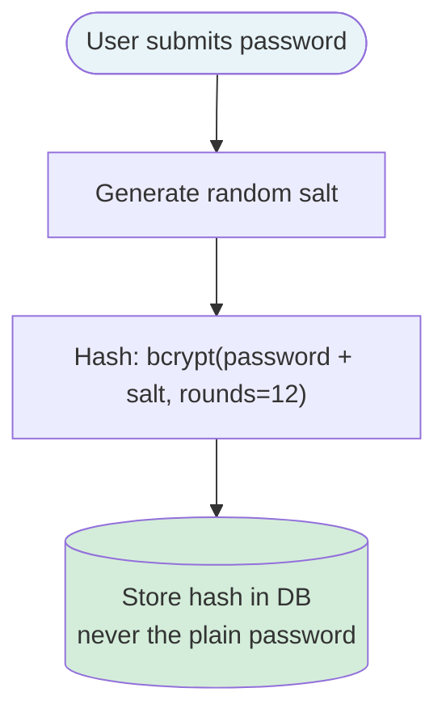
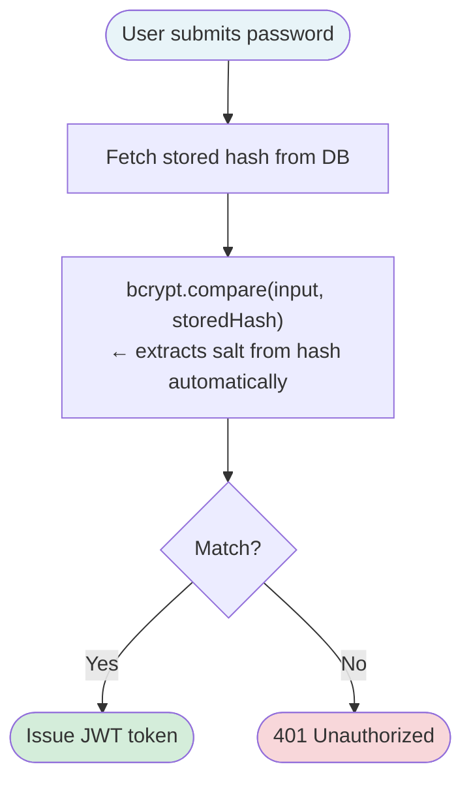
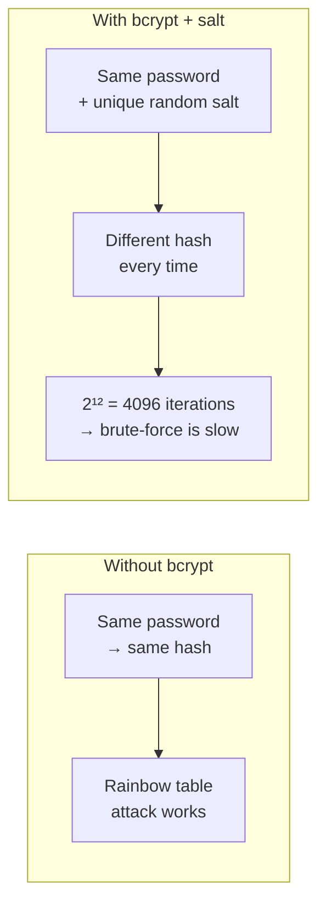

# Password Hashing — ft_transcendence

## Signup Flow



## Login Flow



## Why bcrypt?



---

## Key Numbers

| Setting | Value | Why |
|---|---|---|
| Algorithm | bcrypt | Slow by design, widely audited |
| Salt rounds | 12 | ~200ms per hash — fast enough for UX, slow for attackers |
| Salt | Auto-generated per user | Two identical passwords → two different hashes |
| Storage | Hash only | Plain password never touches the database |

## How verification works (no decryption)

The salt is **stored inside the hash string itself** — bcrypt embeds it in plain text:

```
$2b$12$N9qo8uLOickgx2ZMRZoMyeIjZAgcfl7p92ldGxad68LkIwhover8em
 ↑   ↑  ←——— salt (22 chars) ———→ ←——— hash (31 chars) ———→
alg cost
```

On login, bcrypt:
1. Reads the salt out of the stored string
2. Re-runs `hash(inputPassword + thatSalt, 12 rounds)`
3. Compares the result — **match = correct password**

No decryption happens. It's a **one-way function** — you repeat the same calculation, not reverse it.

## Why storing the salt in plain text is safe

The salt's job is not to be secret — it's to make every hash **unique**:

```
"password123" + "salt_user1"  →  "xyz987..."   ← unique
"password123" + "salt_user2"  →  "qrs456..."   ← unique
```

Without a salt, an attacker could pre-compute `word → hash` for millions of passwords (rainbow table) and look yours up instantly. With a unique salt per user, they'd need a separate table for every possible salt — computationally impossible.

## Why 12 rounds makes brute-force impractical

```
rounds = 12  →  2¹² = 4,096 Blowfish cipher iterations per guess
```

Each password attempt costs ~200ms on modern hardware. For a real login that's fine. For an attacker trying billions of passwords — it becomes years of compute time.

## One-liner for evaluators

> *"The salt lives inside the hash string. On login bcrypt re-hashes the input with that same salt and compares — no decryption, just repeat the same one-way calculation. 12 rounds = 4096 iterations per guess, making brute-force impractical."*
