# Modules Demo Guide — ft_transcendence

> **Rule:** 14 points minimum to pass. We claim 18 (4pt safety buffer).
> Demo each module fully — show it working, don't just describe it.

---

## Point Summary

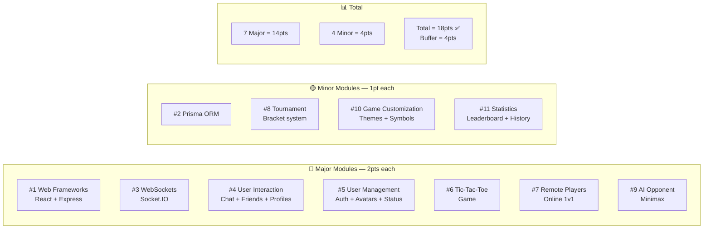

---

## Module Map

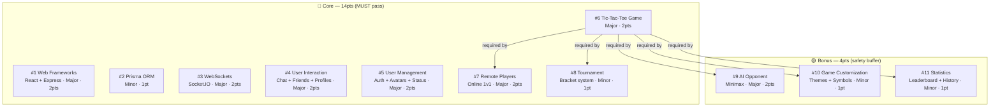

---

## #1 — Web Frameworks `Major · 2pts`

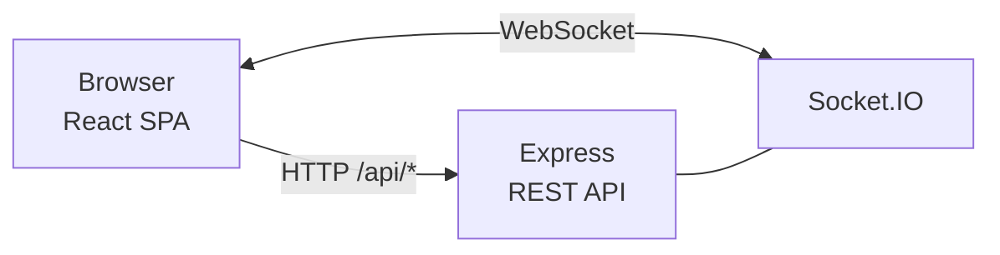

**Demo:** App is running → DevTools → Network → any `/api/` call → confirm Express responds.

**Say:** _"React handles the UI, Express handles the API. Both are real frameworks — not plain HTML/CSS or raw Node."_

---

## #2 — Prisma ORM `Minor · 1pt`

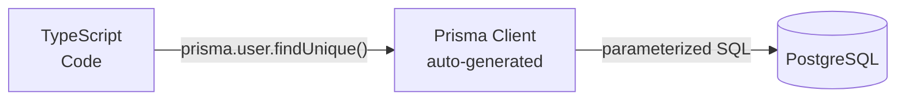

**Demo:** Show `backend/prisma/schema.prisma` → point to any service file with a Prisma query.

**Say:** _"Type-safe queries, auto-generated from the schema. No raw SQL. Migrations tracked in `prisma/migrations/`."_

---

## #3 — WebSockets `Major · 2pts`

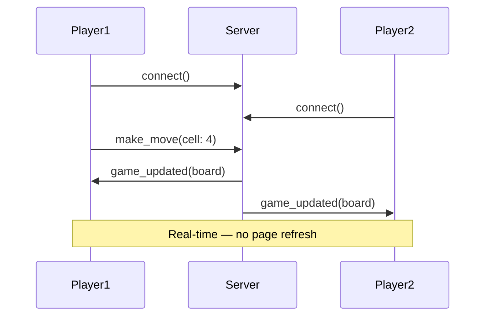

**Demo:** Two browser windows logged in as different users → make a move → other player sees it instantly → open DevTools WS tab to show socket frames.

**Say:** _"Persistent WebSocket connection — moves, chat, and presence updates are pushed to all clients in real time."_

---

## #4 — User Interaction `Major · 2pts`

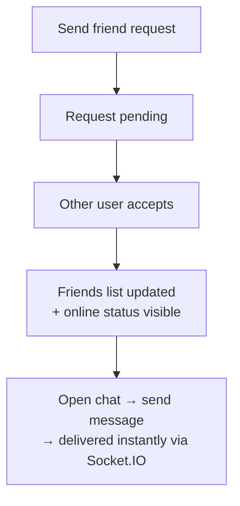

**Demo:** Send friend request from User A → accept from User B → open chat → send messages both ways → visit each other's profiles.

---

## #5 — User Management `Major · 2pts`

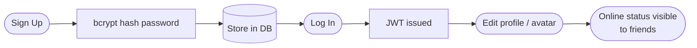

**Demo:** Sign up → log in → edit display name + upload avatar → log out → log in again → confirm data persisted.

---

## #6 — Tic-Tac-Toe Game `Major · 2pts` ⚠️ dependency for #7–#11

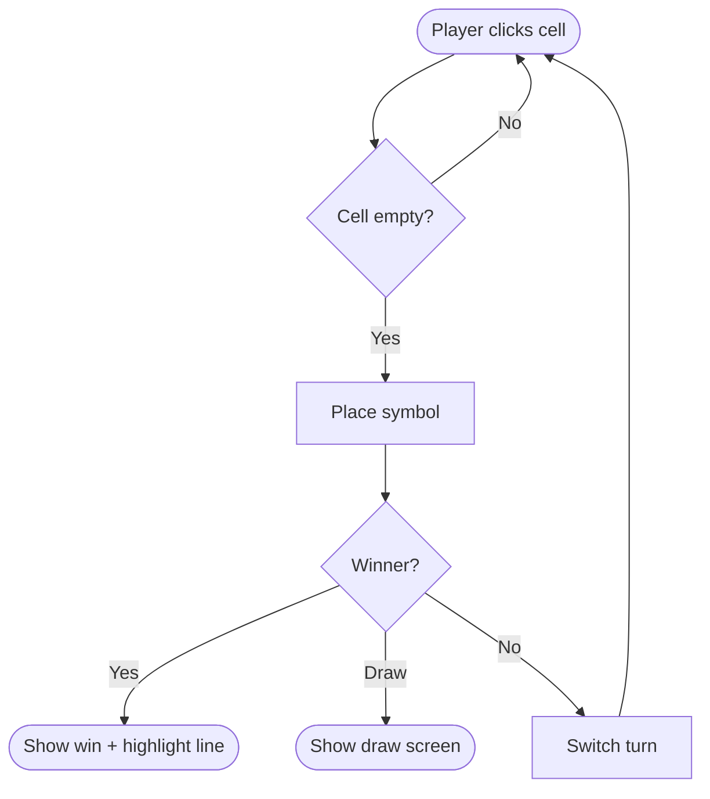

**Demo:** Play a full local game. Show win highlight. Show draw. Show Play Again.

**Say:** _"Server-authoritative win detection — client sends move, server validates and responds with game state."_

---

## #7 — Remote Players `Major · 2pts`

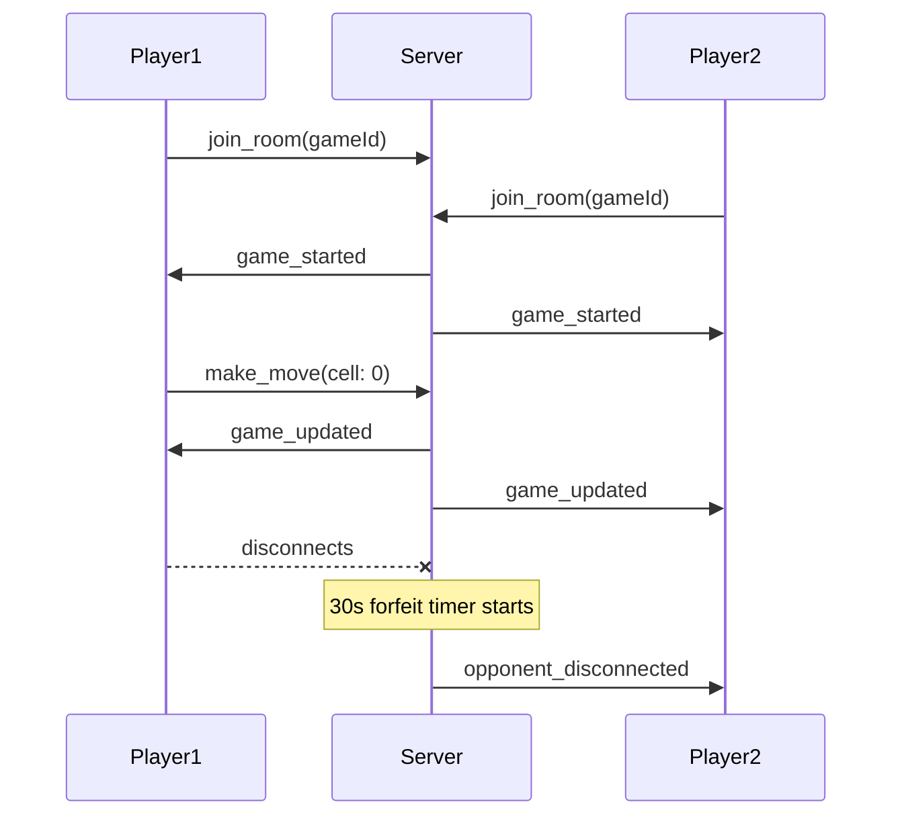

**Demo:** Two windows play a full online game → mid-game, close one tab → show the forfeit timer → other player wins.

---

## #8 — Tournament `Minor · 1pt`

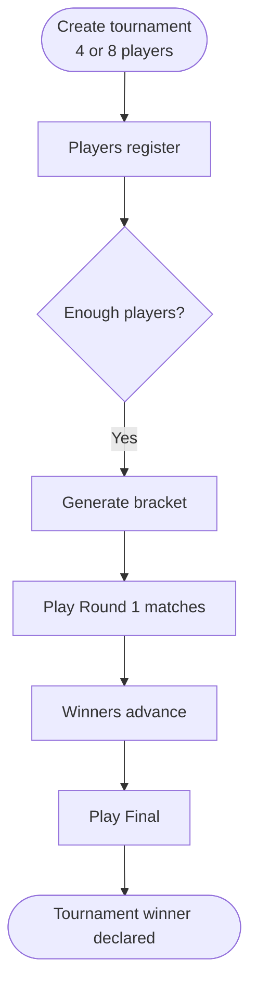

**Demo:** Create → register 4 players → start → show bracket view → play matches → show winner.

---

## #9 — AI Opponent `Major · 2pts`

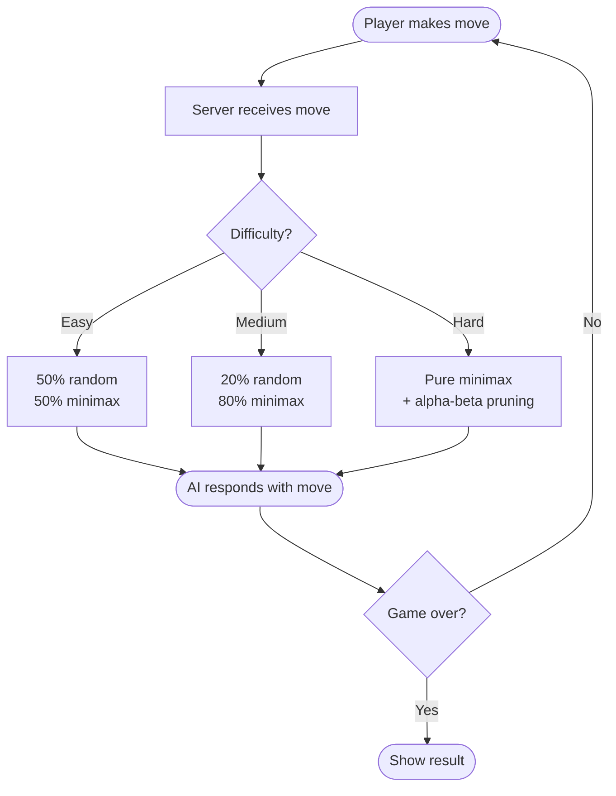

**Demo:** Start AI game → play on Hard → show AI blocking your winning moves → switch to Easy → show it plays weaker.

**Say:** _"Minimax with alpha-beta pruning. Difficulty controls how often it picks a random move instead of the optimal one — makes it feel human."_

---

## #10 — Game Customization `Minor · 1pt`

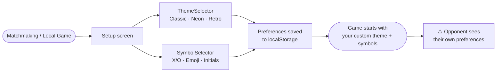

**Demo:** Go to Local Game or Matchmaking → pick Neon theme → pick emoji symbols → start game → confirm theme and symbols appear.

---

## #11 — Statistics `Minor · 1pt`

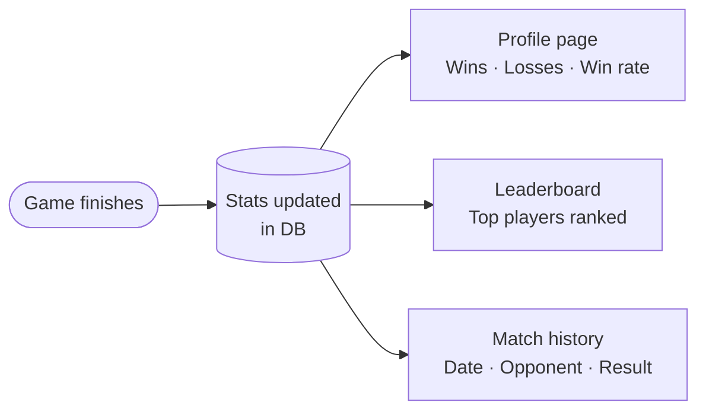

**Demo:** Open your profile → show win/loss stats → open leaderboard → finish a game → refresh → confirm stats updated.

---

## Safety Net

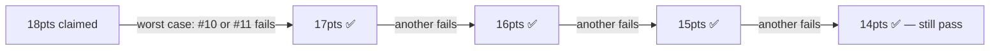

> We have a **4-point buffer**. Even if 4 minor modules are rejected, we still pass at 14pts.
