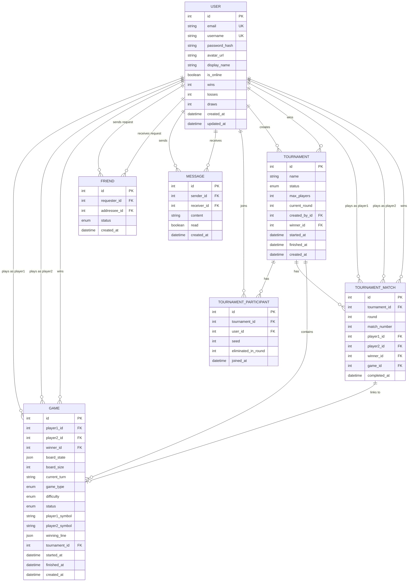

# Database Schema — ft_transcendence

---

## Legend

| Symbol      | Meaning                                |
| ----------- | -------------------------------------- |
| `PK`        | Primary key                            |
| `FK`        | Foreign key                            |
| `UK`        | Unique constraint                      |
| `\|\|--o{`  | One-to-many (required → optional many) |
| `\|\|--o\|` | One-to-one (optional)                  |

## Enums

| Field               | Values                                                                 |
| ------------------- | ---------------------------------------------------------------------- |
| `game_type`         | `CLASSIC`, `CUSTOM`, `TOURNAMENT`, `AI`                                |
| `game.status`       | `WAITING`, `IN_PROGRESS`, `FINISHED`, `DRAW`, `CANCELLED`, `ABANDONED` |
| `difficulty`        | `EASY`, `MEDIUM`, `HARD`                                               |
| `friend.status`     | `PENDING`, `ACCEPTED`, `BLOCKED`                                       |
| `tournament.status` | `REGISTERING`, `IN_PROGRESS`, `FINISHED`, `CANCELLED`                  |
| `board_size`        | `3` (3×3), `4` (4×4), `5` (5×5)                                        |
