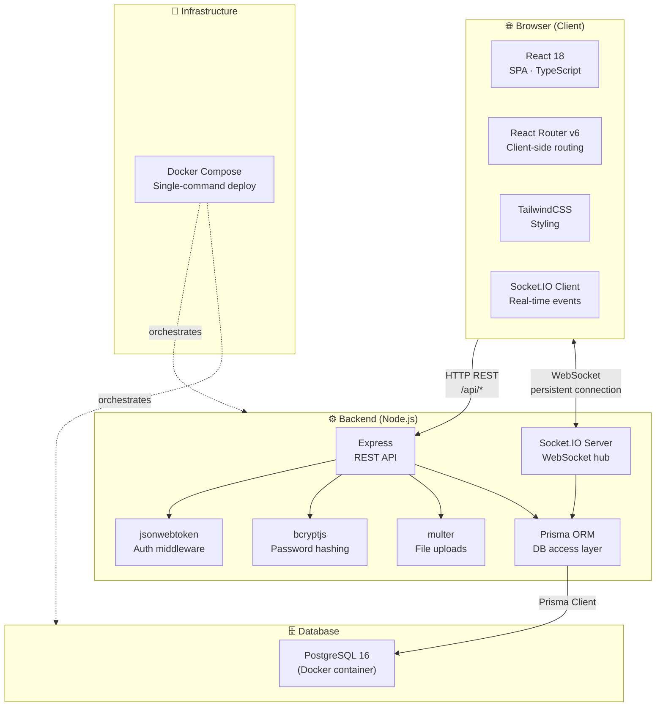

# Tech Stack — ft_transcendence

---

## Justification Table

| Technology | Role | Why we chose it |
|---|---|---|
| **React 18** | Frontend SPA | Component model, fast re-renders, ecosystem maturity |
| **TypeScript** | Both layers | Compile-time safety, catches type bugs early |
| **React Router v6** | Client routing | Declarative routes, nested layouts, no page reloads |
| **TailwindCSS** | Styling | Utility-first, no naming conflicts, responsive built-in |
| **Socket.IO** | Real-time | Reliable WebSocket + fallback, rooms/events API built-in |
| **Node.js + Express** | REST API server | Same language as frontend, lightweight, fast prototyping |
| **Prisma ORM** | DB access | Type-safe queries, auto-generated client, easy migrations |
| **PostgreSQL 16** | Persistence | ACID guarantees, relational model fits our schema |
| **jsonwebtoken** | Auth | Stateless JWT, no session store needed |
| **bcryptjs** | Password hashing | Adaptive cost factor, industry-standard salting |
| **multer** | File uploads | Express middleware, handles multipart/form-data |
| **Docker Compose** | Deploy | Single `docker compose up`, reproducible across machines |

---

## Communication Channels

| Channel | Protocol | Used for |
|---|---|---|
| REST API | HTTPS (`/api/*`) | Auth, profile, friends, chat history, stats |
| WebSocket | Socket.IO | Live game moves, matchmaking queue, presence, chat |
